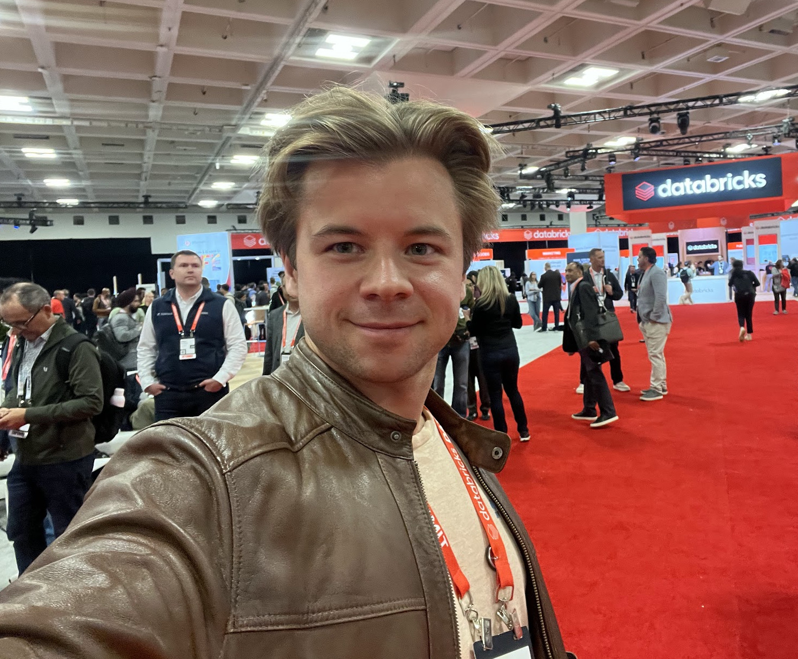

I help helping industrial enterprises harness Databricks for their data-intensive workloads. With over 4 years of intensive Spark and Databricks experience, I focus on data integration, advanced analytics, and data quality across industries including metals production and renewable energy.

My expertise was developed as a data engineer at Novelis, where I led the transfer of process data from rolling mills and furnaces to the cloud using Databricks for high-quality analysis. Combined with my background as a process engineer in aluminium production, I bring deep understanding of both industrial operations and modern data platforms, enabling me to bridge the gap between legacy plant systems and cutting-edge Databricks solutions.

