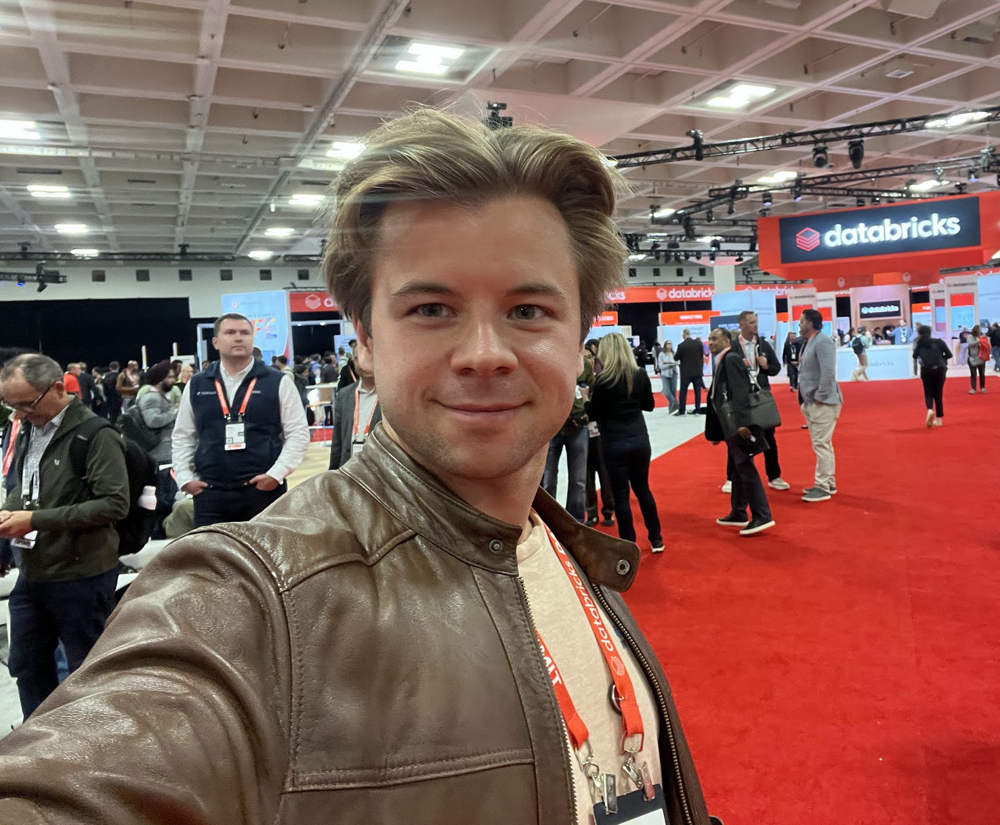

I'm Denis Gontcharov. I work as a Business Development Representative at Databricks in Amsterdam.

Before joining Databricks I was as independent data engineer helping data product owners in manufacturing and energy with ingesting time series data from SCADA systems into Azure Databricks. I've worked over six years with industrial data and control systems before transitioning into my current sales role. I hold a degree in Materials Engineering from KU Leuven in Belgium.

Outside of work, my greatest passion are European languages. I'm native in Dutch and Russian and fluent in English, French, and German. I no longer actively develop software, but to scratch my nerdy itch I still explore every new Databricks feature and play with my Void Linux configuration.

On this website you will learn more about what drives me. I write a newsletter about transitioning from engineering into tech sales at Databricks to which you can [subscribe here](https://gontcharov.eu/newsletter/).

*Databricks Data & AI Summit, San Francisco CA, June 2025*

# Nice Things Others Said About Me

> Denis is a very gifted Data Engineer, having the innate understanding of data in the space of manufacturing. I had the opportunity to work with Denis for a year at Novelis and during this brief time he had left an impact within the team.

— [Cynthia Khan](https://www.linkedin.com/in/khancynthia/), *Data Engineering Services Manager at Novelis*

 

> Denis did a great job building the data infrastructure for our IoT-related features at ForkOn. He is highly focused, well organised and motivated. He sets very high standards for his work, which always has lead to excellent quality results.

— [Dr. Vlada Pototskaia](https://www.linkedin.com/in/vpototsk/), *Head of Engineering at ForkOn*

 

> Denis worked at Trimet France and has developed R shiny apps for our production needs. We were really impressed by his commitment, the speed and quality of his work.

— [Olivier Granacher](https://www.linkedin.com/in/oliviergranacher/), *Senior Process Engineer at Trimet France*

 

> Denis is a sharp and talented data engineer with a strong entrepreneurial spirit. His ability to combine technical expertise with forward-thinking solutions makes him a valuable collaborator. It has been a pleasure working with him, and I look forward to seeing where his talents take him next.
— [Dr. Martin Iffert](https://www.linkedin.com/in/dr-martin-iffert-3270678/), *Expert in Aluminium Decarbonization*