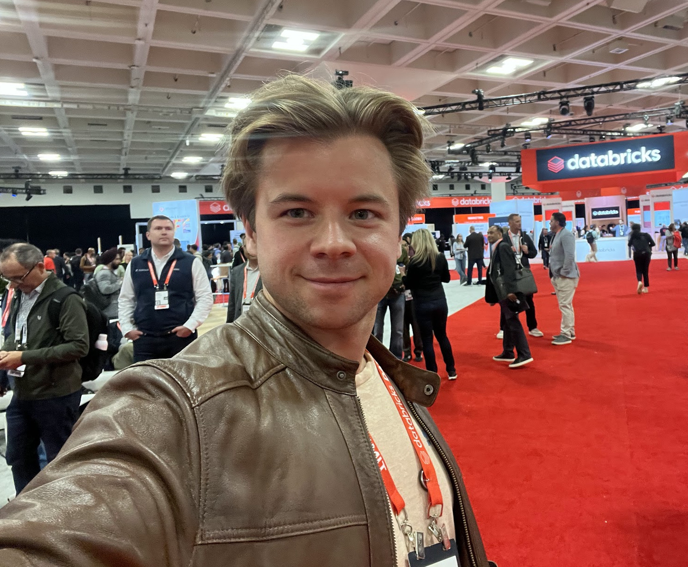

I'm Denis Gontcharov. I work as a Business Development Representative at Databricks in Amsterdam.

# Summary

Before joining Databricks I was as independent data engineer helping data product owners in manufacturing and energy with ingesting time series data from SCADA systems into Azure Databricks. I've worked over six years with industrial data and control systems before transitioning into my current sales role. I hold a degree in Materials Engineering from KU Leuven in Belgium.

After work, I enjoy building solutions on Databricks that improve my sales performance on the job. Although I'm no longer a professional data engineer, I'm passionate about leveraging the power of data to create insights that increase my sales, and sharing these solutions with my team at Databricks.

Outside of work, my greatest passion are European languages. I'm native in Dutch and Russian and fluent in English, French, and German. I'm no longer a digital nomad, but I still enjoy travel and spend most of my holidays in Central and Eastern Europe.

On this website you will learn more about what drives me. I write a newsletter about using data to improve the performance of our sales teams at Databricks to which you can [subscribe here](https://gontcharov.eu/newsletter/).

*Databricks Data & AI Summit, San Francisco CA, June 2025*

# How I Got Into Data

I graduated from a highly quantitative field (Materials and Chemical Engineering) and always imagined myself working at a factory in the metallurgical industry. That dream came true during my internship at a primary aluminium smelter in France. What I didn't realize at the time, was the vast amounts of data that are being generated every minute: material flows, temperatures, control feedback, etc.

Realizing I needed to be able to wrangle data efficiently to do my job effectively, I started experimenting with the programming language R in combination with SQL. This was in 2018, at the crest of the Data Science hype wave. What started as me doing data visualization and applied statistics, quickly spiraled out of control and became an obsession with Data Science. I enjoyed applying new statistical methods to my internship projects and spending evenings studying up on cutting edge machine learning topics.

I was hired by the company in a Process Engineering job but soon realized it could never sate my thirst of data work. Therefore, I left the company after two years to pursue a career in data full-time, first at the data consultancy firm called [statworx](https://www.statworx.com/en) and later as an independent data engineer in my own business.

# How I Got Into Tech Sales

While I enjoyed working with data immensely, my own nature worked against me. I enjoy very fast-paced environments with fast feedback loops and some degree of and randomness. I'm more comfortable with probability than certainty. By this I mean that long hours of sustained focus on minute details makes me anxious. I need an environment with lots of stimulation that gives me high dopamine spikes. I've always been restless and thirsting for adventure and I don't think I'll ever change. These conditions are the opposite of what's required for meticulous software development...

Running my own business for almost five years, required me to do lots of activities besides my technical work: negotiation with recruiters, designing sales pages for my services, prospecting my network, writing newsletters and even recording [my own podcast series](https://gontcharov.eu/posts/podcast/e07-jim-gavigan/). While most engineers abhor such things, I caught myself greatly enjoying them. In fact, a whole day of coding often made me feel drained and anxious, whereas talking to clients and prospect energized me.

I still liked coming up with data solutions for business problems - how could I stay in data but focus more on the business? I found my salvation in a sales job at Databricks. There, I'm able to dive deep into our customer's problems and leverage my knowledge of the product into a technical solution. I'm no longer the engineer writing the code (if engineers still write code by hand these days). I'm now greatly enjoying my work days getting my dopamine hits from cold calling, learning qualification and discovery, and building account plans.

# Nice Things Others Said About Me

> A year ago data issues took days to be detected and more often than not more days to resolve. This time, the Data Quality Framework [developed by Denis] automatically detected at 7 AM, automated monitoring made us skip root cause analysis entirely! The dataflow is back within 2 hours after start of business.

— [Pascal Dubucq](https://www.linkedin.com/in/dr-pascal-dubucq-01aa99139), *Data Product Owner at RWE Renewables*, 2025

 

> Denis is a very gifted Data Engineer, having the innate understanding of data in the space of manufacturing. I had the opportunity to work with Denis for a year at Novelis and during this brief time he had left an impact within the team.

— [Cynthia Khan](https://www.linkedin.com/in/khancynthia/), *Data Engineering Services Manager at Novelis*, 2023

 

> Denis did a great job building the data infrastructure for our IoT-related features at ForkOn. He is highly focused, well organised and motivated. He sets very high standards for his work, which always has lead to excellent quality results.

— [Dr. Vlada Pototskaia](https://www.linkedin.com/in/vpototsk/), *Head of Engineering at ForkOn*, 2021

 

> Denis worked at Trimet France and has developed R shiny apps for our production needs. We were really impressed by his commitment, the speed and quality of his work.

— [Olivier Granacher](https://www.linkedin.com/in/oliviergranacher/), *Senior Process Engineer at Trimet France*, 2019

 

> Denis is a sharp and talented data engineer with a strong entrepreneurial spirit. His ability to combine technical expertise with forward-thinking solutions makes him a valuable collaborator. It has been a pleasure working with him, and I look forward to seeing where his talents take him next.

— [Dr. Martin Iffert](https://www.linkedin.com/in/dr-martin-iffert-3270678/), *Expert in Aluminium Decarbonization*
