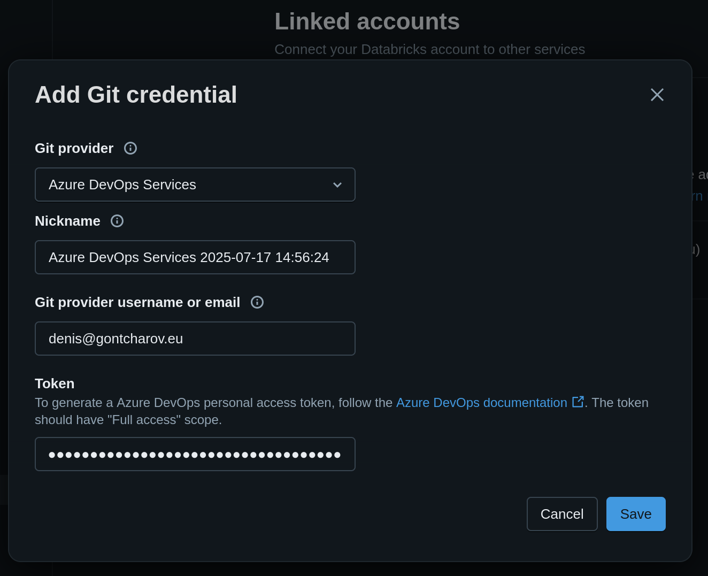
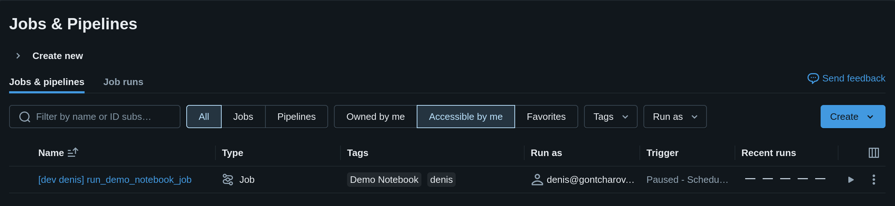
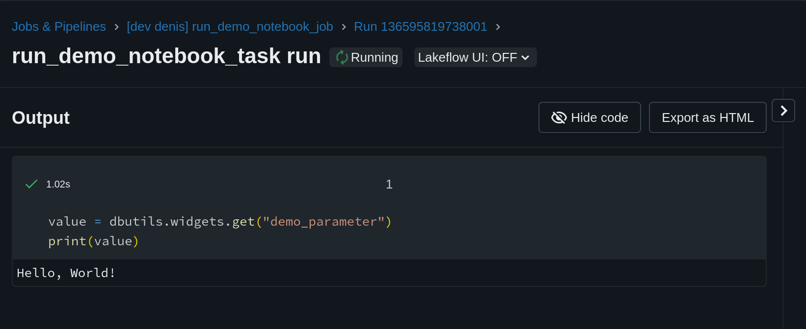

# Objectives

In this post we will deploy Databricks resources defined in Databricks Asset Bundles or DABs from a Git repository hosted on Azure DevOps using Azure DevOps pipelines. It's not uncommon that your code differs slightly in each Databricks environment (dev, test, prod). For example, you may have an Azure key vault `my_key_vault_dev` for the development workspace and `my_key_vault_prod` for the production workspace. We will see how to pass this workspace-dependent data from the DAB to Databricks Notebooks via widgets.

In summary, we will learn how to:

* Allow Databricks to access your Azure DevOps Git repository.
* Write Azure DevOps pipelines YAML files.
* Define Databricks resources in a DAB.
* Learn how to use the Databricks CLI to validate and deploy DABs.

# Project Overview

The project directory consists of just three files and a README:

```stdout
.
├── README.md
├── azure_devops_pipeline.yml
├── databricks.yml
└── demo_notebook.ipynb
```

The various components are:

1. Notebook 
2. DAB notebook task
3. Azure DevOps pipeline

# The notebook

Explain what the notebook does. Mention that the parameter is read from a widget.

# Databricks Asset Bundle (DAB)

Text.

## Databricks Asset Bundle file

```yaml
bundle:
  name: "DAB-Demo"
  uuid: "05622722-fb3a-4a17-8f1f-c3c1d37ececb"

variables:
  git_branch:
    description: "Git branch to use for job source code"
  demo_parameter_value:
    description: "Text value to pass as a Databricks notebook parameter"

presets:
  tags:
    application: "Demo Notebook"

targets:
  free:
    mode: development
    workspace:
      host: https://dbc-e667f434-e97e.cloud.databricks.com
    variables:
      git_branch: main
      demo_parameter_value: "Hello, World!"

resources:
  jobs:
    run_demo_notebook:
      name: run_demo_notebook_job
      tasks:
        - task_key: run_demo_notebook_task
          notebook_task:
            notebook_path: demo_notebook
            base_parameters:
              demo_parameter: ${var.demo_parameter_value}
            source: GIT
      git_source:
        git_url: https://gontcharovd@dev.azure.com/gontcharovd/databricks-dab-demo/_git/databricks-dab-demo
        git_provider: azureDevOpsServices
        git_branch: ${var.git_branch}
      schedule:
        quartz_cron_expression: "0 0 7 * * ?"  # Daily at 7:00 AM UTC
        timezone_id: "UTC"
bundle:
  name: "DAB-Demo"
  uuid: "05622722-fb3a-4a17-8f1f-c3c1d37ececb"

variables:
  git_branch:
    description: "Git branch to use for job source code"
  demo_parameter_value:
    description: "Text value to pass as a Databricks notebook parameter"

presets:
  tags:
    application: "Demo Notebook"

targets:
  free:
    mode: development
    workspace:
      host: https://dbc-e667f434-e97e.cloud.databricks.com
    variables:
      git_branch: main
      demo_parameter_value: "Hello, World!"

resources:
  jobs:
    run_demo_notebook:
      name: run_demo_notebook_job
      tasks:
        - task_key: run_demo_notebook_task
          notebook_task:
            notebook_path: demo_notebook
            base_parameters:
              demo_parameter: ${var.demo_parameter_value}
            source: GIT
      git_source:
        git_url: https://gontcharovd@dev.azure.com/gontcharovd/databricks-dab-demo/_git/databricks-dab-demo
        git_provider: azureDevOpsServices
        git_branch: ${var.git_branch}
      schedule:
        quartz_cron_expression: "0 0 7 * * ?"  # Daily at 7:00 AM UTC
        timezone_id: "UTC"
```

## Authorize Databricks to pull code from Azure DevOps repo

Databricks needs to authenticate with Azure DevOps to pull the Git repository in the workspace. This requires creating a Personal Access Token (PAT) in Azure DevOps.

In Azure DevOps, navigate to "user settings" in the top-right corner (next to your account profile picture). Click on "Personal access tokens". Create a new token with read/write access for Code for your organization or project. Copy the value.

In Databricks, click on your account profile picture in the top-right corner. Go to "Settings" and to "Linked accounts". Click on "Add Git credential". Fill out the fields (picture below) and paste the PAT value copied in earlier.



## Deploying the DAB

```bash
databricks auth login --profile free. Config: host=https://dbc-e667f434-e97e.cloud.databricks.com, profile=free
```

Let's validate the bundle:

```bash
databricks bundle validate -t free
```

Output:

```stdout
Name: DAB-Demo
Target: free
Workspace:
  Host: https://dbc-e667f434-e97e.cloud.databricks.com
  User: denis@gontcharov.eu
  Path: /Workspace/Users/denis@gontcharov.eu/.bundle/DAB-Demo/free

Validation OK!
```

Deploy the bundle:

```bash
databricks bundle deploy -t free
```

Output:

```stdout
Uploading bundle files to /Workspace/Users/denis@gontcharov.eu/.bundle/DAB-Demo/free/files...
Deploying resources...
Updating deployment state...
Deployment complete!
```

## Running the workflow

We can see the final workflow in the Jobs & Pipelines view:



Click on the "Play" button to execute the job:



# Configuring Azure DevOps

## Azure DevOps Pipeline

```yml
trigger:
  branches:
    include:
    - main
  paths:
    include:
      - demo_notebook.ipynb
      - databricks.yml
      - azure_devops_pipeline.yml

jobs: 
  - job: DeployFree
    displayName: "Deploy to free Databricks workspace"
    condition: eq(variables['Build.SourceBranch'], 'refs/heads/main')
    variables:
      - group: databricks-free-variable-group
    steps:
      - script: |
          curl -fsSL https://raw.githubusercontent.com/databricks/setup-cli/main/install.sh | sh
        displayName: 'Install Databricks CLI'
        
      - task: Bash@3
        displayName: 'Validate Databricks Bundle for $(DATABRICKS_WORKSPACE)'
        inputs:
          targetType: 'inline'
          script: |
            export DATABRICKS_TOKEN="$(DATABRICKS_TOKEN)"
            databricks bundle validate -t $(DATABRICKS_WORKSPACE)
            
      - task: Bash@3
        displayName: 'Deploy Databricks Bundle to $(DATABRICKS_WORKSPACE)'
        inputs:
          targetType: 'inline'
          script: |
            export DATABRICKS_TOKEN="$(DATABRICKS_TOKEN)"
            databricks bundle deploy -t $(DATABRICKS_WORKSPACE)
```

## Create a Databricks PAT

Personal access tokens can be used for secure authentication to the Databricks API instead of passwords. Create a Databricks PAT by clicking on your user profile picture in the top right corner. Click on "settings", go to "Developer" and click on "Manage" under Access Tokens. Generate a new token and copy the value.

## Configure Azure DevOps variable group

Go to "Library" and create a new variable group `databricks-free-variable-group`. Create a new secret variable `DATABRICKS_TOKEN` and paste the copied PAT value. Create a second (non-secret) variable `DATABRICKS_WORKSPACE` and write the value "free". This will be the target Databricks workspace in which we will deploy the DAB resources.

## Create the Azure DevOps pipeline

In Azure DevOps, navigate back to the pipeline tab. Click the "Create Pipeline" button. Select "Azure Repos" and choose "Existing Azure Pipelines YAML file". Select the YAML-file containing your Azure DevOps pipeline code.

When you run the pipeline the first time, it will request permissions to use the variable group. Click on "Permit".

