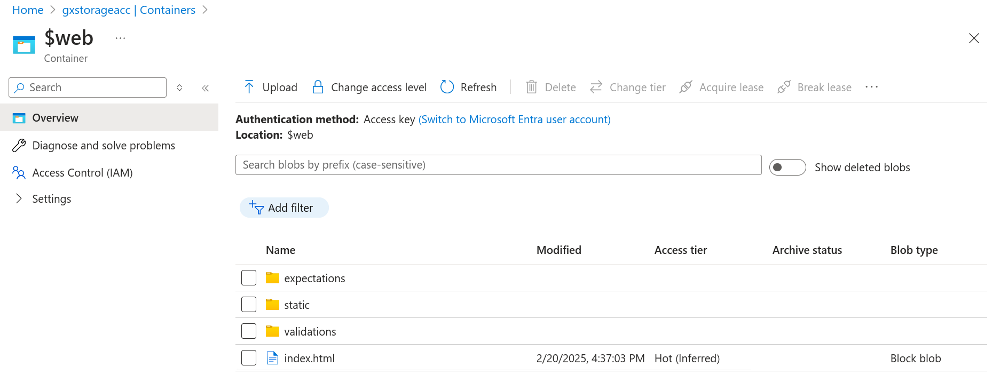
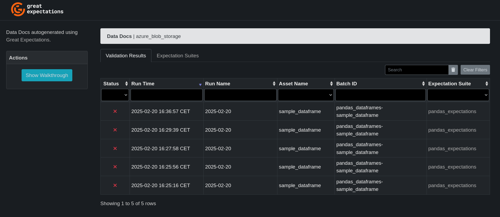

# Resources

* Check out the complete code on [GitHub](https://github.com/gontcharovd/great_expectations_azure).
* Browse the GX Data Doc on [Azure Blob Storage](https://gxstorageacc.blob.core.windows.net/$web/index.html).

# Use Case

Last week I [explored Soda as a data quality testing framework](https://gontcharov.eu/posts/exploring-soda-data-quality-framework/#use-case) for my large enterprise client. This week I'm exploring a more mature alternative called [Great Expectations](https://greatexpectations.io/) or GX in short.

GX generates neat HTML reports called [Data Docs](https://docs.greatexpectations.io/docs/0.18/reference/learn/terms/data_docs/) that give an overview of your data quality test results. The client wants to share these reports with the team - but not with the world! As the client is already using Azure, hosting the report files on Azure Blob Storage seems like a good solution.

# Why Azure Blob Storage?

## 1. Easy Implementation

Installing new solutions at enterprises is notoriously difficult. There's often a long procurement process and many budget-approval hoops to jump through. Because the client is already using Azure, it's only a small step to provision an additional Blob Container.

## 2. Familiar Access Control

As the Blob Container becomes part of the client's Azure ecosystem, the existing IT-team can easily manage access to the Data Docs using RBAC[^1]. There are no new security-measures to implement.

# Solution

This solution is a direct implementation of the GX documentation about [how to host and share Data Docs on Azure Blob Storage](https://legacy.017.docs.greatexpectations.io/docs/0.16.16/guides/setup/configuring_data_docs/how_to_host_and_share_data_docs_on_azure_blob_storage/). 

## Sample Data

The code defines two expectations for the following simple Pandas dataframe:

1. The `NumericColumn` may only have values between **0** and **90**.
1. The `TextColumn` may only have values from **"Item 1"** to **"Item 10"**.

```stdout
   NumericColumn TextColumn
0             10     Item 1
1             20     Item 2
2             30     Item 3
3             40     Item 4
4             50     Item 5
5             60     Item 6
6             70     Item 7
7             80     Item 8
8             90     Item 9
9            100    Item 10
```

## Code

I won't go into the same steps in detail here. Rather, I'll highlight a couple of important points:

* I configured the following `azure_blob_storage` site definition in my [great_expectations.yml](https://github.com/gontcharovd/great_expectations_azure/blob/1788ea3b2f1195d2290ff2c8a4c6f32b0702eb4b/gx/great_expectations.yml#L83) file.

```yaml
  azure_blob_storage:  # this is a user-selected name - you can select your own
    class_name: SiteBuilder
    store_backend:
       class_name: TupleAzureBlobStoreBackend
       container: \$web
       connection_string: ${AZURE_STORAGE_CONNECTION_STRING}
    site_index_builder:
      class_name: DefaultSiteIndexBuilder
```

* If you are running the [setup_gx.py] file for the first time, don't forget to set `do_config = True` and update the path in `CONTEXT_DIR` to your system.

* Don't forget to set your [Azure Blob Storage connection string](https://learn.microsoft.com/en-us/azure/storage/common/storage-configure-connection-string) in the `connection_string` option. As this value is secret, it's not included in my repository.

# Result

I think the result looks pretty neat. The *index.html* along with the other files are created in a Blob Container **$web**:



The final result can be accessed by anyone on the internet [here](https://gxstorageacc.blob.core.windows.net/$web/index.html#). We see that five GX runs have been made, resulting in five Validation Results.



Note how the Expectation Suites tab gives more information about the Expectation Suites, in this case **panda_expectations**. This feature gives business users clear information about how the date they're using has been tested.

# Conclusion

Overall, I quite like the Great Expectations framework so far. Comparing it to [Soda Core](https://gontcharov.eu/posts/exploring-soda-data-quality-framework/#use-case) there's a couple of points I prefer about GX:

1. GX has more open-source features, e.g. Data Docs.
2. Although GX is more convoluted, the organization of Expectations into Suites allows to maintain order as the project grows.
3. The community behind GX seems sufficiently active.
4. No date is shared outside of the company to access certain features, as opposed to Soda Cloud.

[^1]: Read more about Role Based Access Control (RBAC) on Azure [here](https://learn.microsoft.com/en-us/azure/role-based-access-control/overview).
