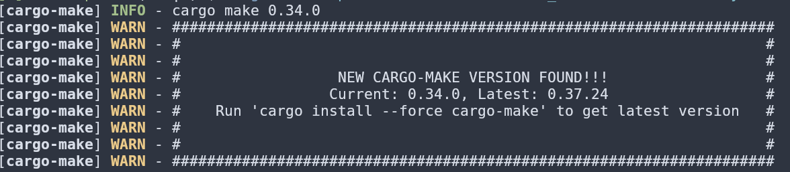

I'm a big fan of text expanders, [espanso](https://espanso.org/) being my favorite one. As Xorg is no longer maintained, I recently switched to Wayland and the Gnome desktop environment.

Unfortunately, I found out that [Wayland support is experimental](https://espanso.org/docs/install/linux/#install-on-wayland). This means espanso has to be installed from source. I browsed some forums and saw that installing espanso on Wayland is tricky.

After some tinkering, I managed to get espanso running on my system:
* Void Linux x86_64 6.12.30_1
* Gnome 47.4 on Wayland

# Install rustup

Install rust via [rustup](https://www.rust-lang.org/tools/install).

```sh
curl --proto '=https' --tlsv1.2 -sSf https://sh.rustup.rs | sh
```

Verify the installation:

```sh
rustc --version
```

# Install other dependencies

Compiling espanso requires *wxWidgets*:

```sh
sudo xbps-install -S wxWidgets-gtk3-devel
```

# Build espanso

Next I followed the espanso [install from source guide](https://espanso.org/docs/install/linux/#wayland-compile).

```sh
git clone https://github.com/espanso/espanso

cd espanso

cargo make --profile release --env NO_X11=true build-binary 
```

The guide recommends `cargo-make` version `0.34.0`, but this caused my installation to fail. 



Upgrading to `cargo-make 0.37.24` solved the issue:

```sh
cargo install --force cargo-make
```

Now retry the installation:

```sh
cargo make --profile release --env NO_X11=true build-binary
```

Complete successfully.

# Crashing on startup

Alas, starting espanso with `espanso service start --unmanaged`[^1] caused it to crash right after startup:  

```sh
$ espanso service start --unmanaged
espanso started correctly!
$ espanso status
espanso is not running
```

Taking a look at logs with `espanso log` shows that we need to install *wl-clipboard*:

```sh
22:08:21 [worker(17213)] [ERROR] unable to call 'wl-paste' binary, please install the wl-clipboard package.
22:08:21 [worker(17213)] [ERROR] thread 'engine thread' panicked at 'failed to initialize clipboard module: wl-clipboard binaries are missing': espanso/src/cli/worker/engine/mod.rs:193
```

Install it:

```sh
sudo xbps-install wl-clipboard
```

Now we can launch espanso successfully.

# Autostart

Running espanso in unmanaged mode means espanso does not rely on the system service manager to run, but as a result, we are in charge of starting/stopping espansowhen needed.

Running espanso on startup can be achieved by creating an autostart file:

```sh
cat > ~/.config/autostart/espanso.desktop << 'EOF'
[Desktop Entry]
Name=Espanso
Comment=Text Expander
Exec=espanso start --unmanaged
Terminal=false
Type=Application
Categories=Utility;
StartupNotify=false
X-GNOME-Autostart-enabled=true
EOF
```

Don't forget to add the CAP_DAC_OVERRIDE capability to the binary's set of Permitted ones[^2]:

```sh
sudo setcap "cap_dac_override+p" $(which espanso)
```

That's it! You can now enjoy espanso on Wayland.

[^1]: Void Linux doesn't have Systemd, which means espanso can't run in managed mode. You can run it in unmanaged mode with `espanso service start --unmanaged`.
[^2]: See [here](https://espanso.org/docs/install/linux/#adding-the-required-capabilities).
