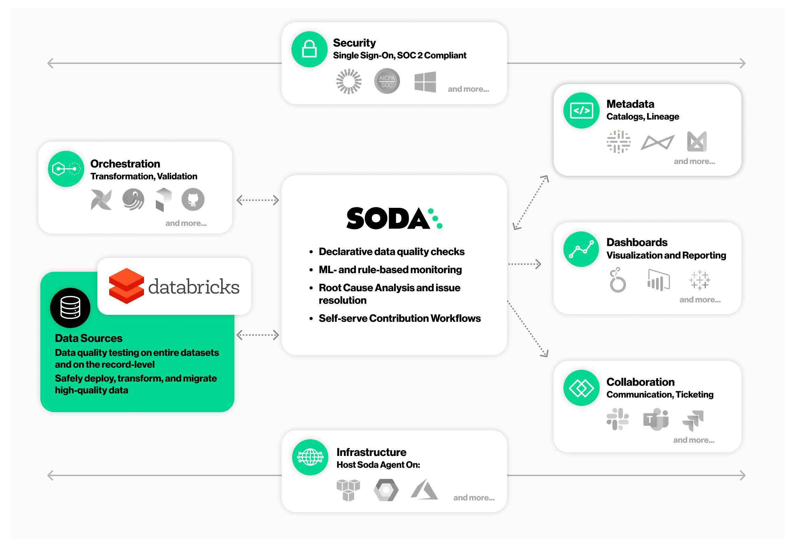
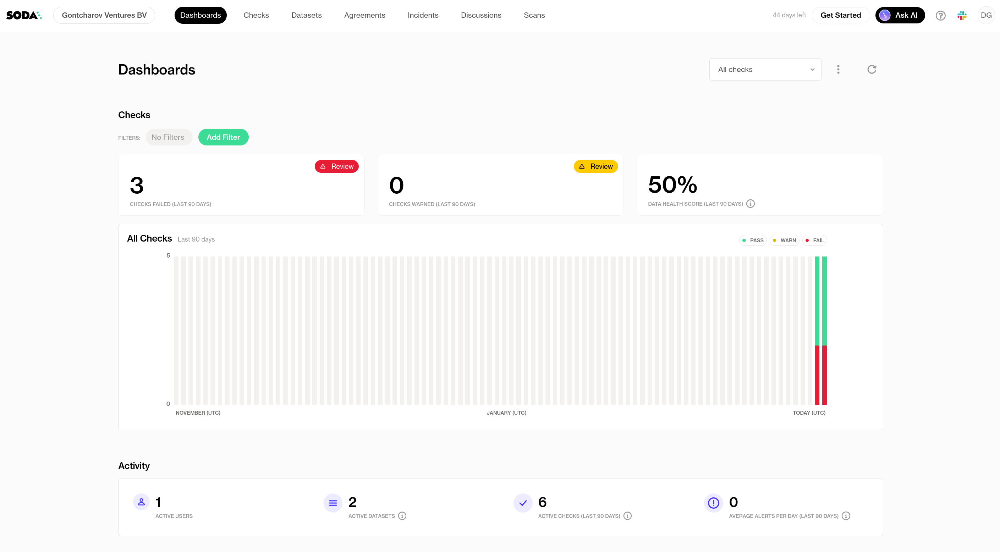

# Use Case

For my current engagement I'm tasked with developing an automated data quality framework for a large industrial enterprise in the renewable energy sector. The client has over a hundred independent SCADA systems from various vendors gathering energy production data. All this data has to flow in one central repository to be analyzed with Databricks. The client is obligated to ensure high data quality for contractual reporting to external parties. Failure to deliver incurs high financial penalties.

# Soda 

Soda built their product offering Soda cloud on top of the open-source Python package Soda Core[^1]. In a nutshell, their solution allows you to:

1. Test your data pipelines
2. Monitor data quality
3. Create reports


*Image source: [Exploring the Soda Data Quality Platform](https://www.soda.io/integrations/databricks)*

# Simple Workflow

To test the framework, I defined a simple workflow that performs a number of data quality checks on two large datasets.

## Installation

First I install the framework on my Databricks notebook:

```sh
pip install -i https://pypi.cloud.soda.io soda-spark-df
```

Next, I import and instantiate the `Scan` class, create a data definition name, and set the data source to be tested to a Spark dataframe:

```python
from soda.scan import Scan

# Create a scan object
scan = Scan()

# Set a scan definition
# Use a scan definition to configure which data to scan,
# and when and how to execute the scan.
scan.set_scan_definition_name("Data Completeness")
scan.set_data_source_name("spark_df")

# Attach a Spark session
scan.add_spark_session(spark)
```

## Configuration

I like the simplicity of Soda's YAML configuration that is stored in my Databricks workspace.

The connection to Scoda Cloud's dashboard and datasources is configured in a *sonda_conf.yml* file:

``` YAML
soda_cloud:
  host: cloud.soda.io
  api_key_id: 2bcda34c-xxxx-xxxx-xxxx-xxxxxxxxxxxx
  api_key_secret: zuNLl1k55YM_XXXXXXXXXXXXXXXXXXXXXXXXXXXXXXXXXXXXXXXXX
```

The actual data quality checks are defined in a *checks.yml* file:

``` YAML
checks for table_one:
  - missing_count(site_id) = 0:
      name: Ensure there are no null values in the site ID column
  - duplicate_count(site_id) = 0:
      name: Ensure there are no duplicate site ID's

checks for table_two:
  - missing_count(device_id) = 0:
      name: Ensure there are no null values in the site ID column
  - num_devices > 50:
      num_devices query: |
        SELECT COUNT(DISTINCT device_id) FROM table_two
```

*Note how I'm defining a custom data quality check with SQL code.*

The configuration is then added to the `scan` instance:

```python
scan.add_sodacl_yaml_file("/Workspace/Users/Denis/Soda/soda_settings/checks.yml")
scan.add_configuration_yaml_file("/Workspace/Users/Denis/Soda/soda_settings/soda_conf.yml")
```

## Result

Executing the checks and viewing the logs is straightforward:

```python
scan.execute()
print(scan.get_logs_text())
```

This is an extract of the output:

```sh
INFO   | Scan summary:
INFO   | 2/4 checks PASSED:
INFO   |     table_one in spark_df
INFO   |       Ensure there are no null values in the site_id column [PASSED]
INFO   |     table_one in spark_df
INFO   |       Ensure there are no null values in the site_id column [PASSED]
INFO   | 2/4 checks FAILED:
INFO   |     table_two in spark_df
INFO   |       Ensure there are no duplicate site_id's [FAILED]
INFO   |         check_value: 1
INFO   |     table_two
INFO   |       num_devices > 50 [FAILED]
INFO   |         check_value: 41.0
INFO   | Oops! 2 failures. 0 warnings. 0 errors. 2 pass.
INFO   | Sending results to Soda Cloud
```

We see that only two of the four checks pass successfully:
* The `site_id` values are not unique for every row.
* There are less than 50 distinct `device_id` values.

# Reporting

What I like about Soda Cloud is the out-of-the-box visualization of my test results. At a glance, I can instantly see how my data quality varies from day-to-day, troubleshoot issues, view data, and even send alarms. 


*Screenshot of my Soda Dashboard*

# Verdict

Soda looks promising, but it's too early to tell whether it fits my current use cases.

What I like:

* Minimalistic design
* Intuitive configuration
* Convenient dashboard

What I *don't* like:

* Data is sent off-premises
* Financial cost[^2]
* Not very mature product yet[^3]

[^1]: Soda Core [documentation](https://docs.soda.io/soda-core/overview-main.html)
[^2]: Even though the cost is low, it still has to go through a lengthy procurement process.
[^3]: I spotted some errors and typos in the documentation.

Overall, I'm excited to continue exploring Soda as a potential alternative to [Great Expectations](https://greatexpectations.io/)!
