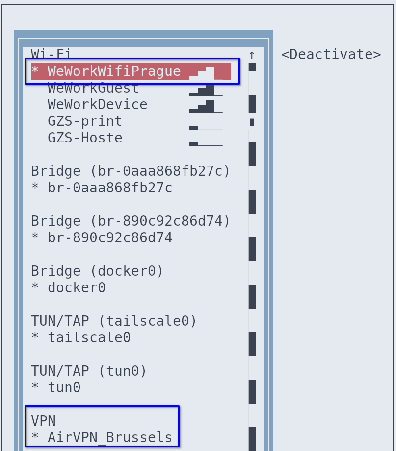

I often work from WeWork, which is a public co-working space with a shared WIFI-network. 

# Securing my connection

For security and privacy reasons, I therefore work behind a VPN. I purchased an [AirPVN](https://airvpn.org/) subscription and configured it as an OpenVPN connection in NetworkManager[^1]:


*NetworkManager's terminal user interface `nmtui`*

This way, even if I'm working from Prague, my location will always be shown as Belgium[^2]. This was important because my current enterprise client's IT-security team kept receiving alarms that my location was changing all over Europe.

# Showing VPN status in Qtile

I use Qtile as my tiling window manager on my work laptop running Void Linux. There is no Qtile widget that displays the VPN status on my screen bar. However, Qtile is highly customizable so I decided to create this widget myself in Python.

Or rather, I let Mistral AI spit out the code for me in a few seconds:


```python
import subprocess
from libqtile.widget import base


class VPNWidget(base.ThreadPoolText):
    """A custom widget to display VPN status using nmcli."""

    defaults = [
        ('update_interval', 5, 'Update interval in seconds.'),
    ]

    def __init__(self, **config):
        # Initialize the base class with the provided config
        base.ThreadPoolText.__init__(self, '', **config)
        # Add default values to the config
        self.add_defaults(VPNWidget.defaults)

    def poll(self):
        """Poll the VPN status."""
        try:
            result = subprocess.run(
                ['nmcli', '-t', '-f', 'TYPE,STATE', 'con', 'show', '--active'],
                stdout=subprocess.PIPE,
                stderr=subprocess.PIPE,
                text=True
            )
            connections = result.stdout.split('\n')
            for conn in connections:
                if conn == 'vpn:activated':
                    return 'VPN Active'
            return 'VPN<span foreground="red"> Inactive</span>'
        except Exception as e:
            return f'VPN: Error ({e})'
```
*Python code generated by Mistral AI in a few seconds and redacted by me* 

# Qtile bar

Now I can see whenever my VPN is active:


... or inactive:


[^1]: I configured the VPN to only access one AirVPN server in Brussels.
[^2]: This [forum post](https://airvpn.org/forums/topic/55115-airvpn-wireguard-networkmanager-linux/) provides a handy guide.

