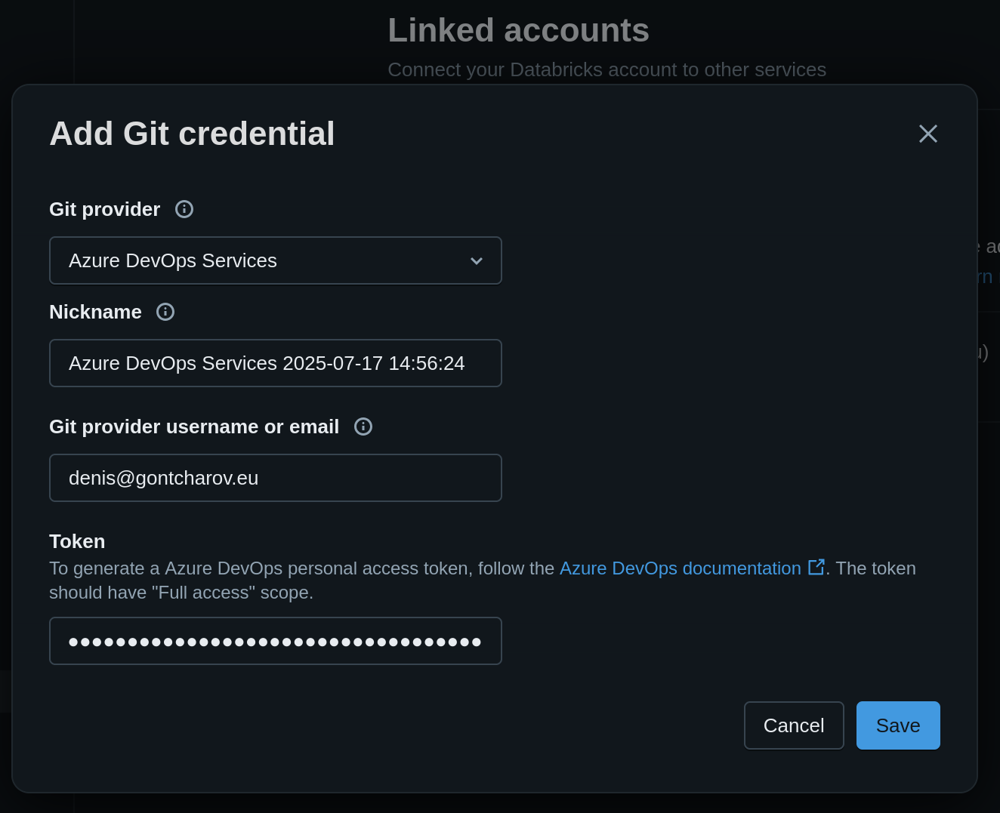
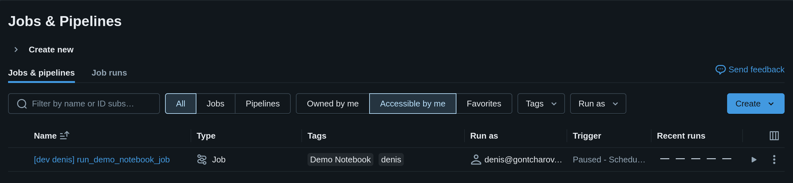
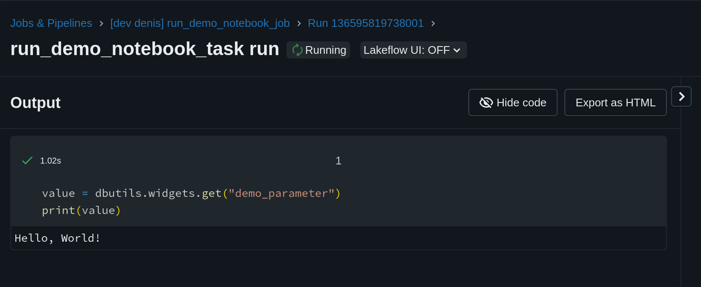
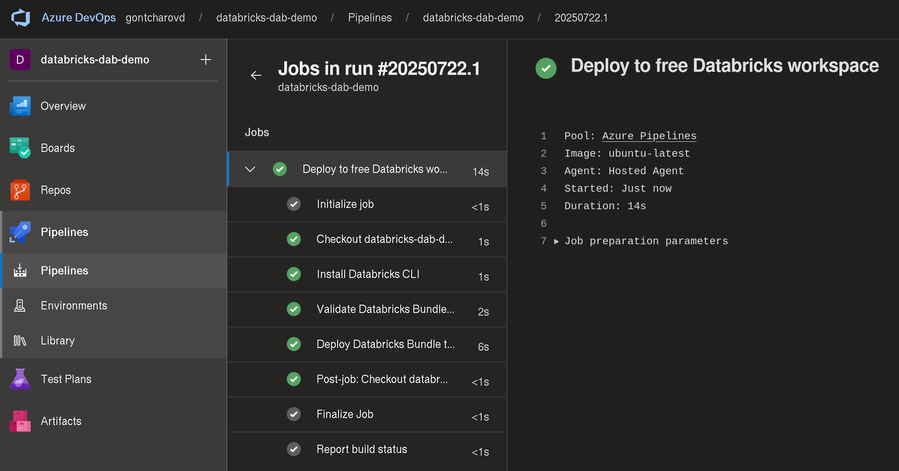

# Video



# Objectives

In this post we will deploy a Databricks Asset Bundle or DAB from a Git repository hosted on Azure DevOps using Azure DevOps pipelines. In summary, we will learn how to:

* Grant Databricks access to your Azure DevOps Git repository.
* Define a simple DAB that deploys a Databricks notebook.
* Learn how to use the Databricks CLI to validate and deploy DABs.
* Write a Azure DevOps pipeline to deploy this DAB.
* Pass parameters from the DAB into the Databricks notebook.

Concerning the last point, it's not uncommon that your code differs slightly in each Databricks environment (dev, test, prod). For example, you may have an Azure key vault `my_key_vault_dev` for the development workspace and `my_key_vault_prod` for the production workspace. We will see how to pass this workspace-dependent data from the DAB to Databricks Notebooks via widgets.

# Project Overview

The project directory in the Git repository consists of just three files and a README:

```stdout
.
├── README.md --> Documentation
├── azure_devops_pipeline.yml --> Azure DevOps pipeline YAML file
├── databricks.yml --> The DAB YAML file with a notebook task
└── demo_notebook.ipynb --> The minimal Databricks notebook
```

On a high level, we define a Databricks notebook. This notebook will be executed as part of a Databricks job defined in the DAB. This DAB will be automatically deployed to our Databricks workspace using the Azure DevOps Pipeline.

# Databricks Notebook

The notebook that is executed by the workflow consists of just two lines:

```python
value = dbutils.widgets.get("demo_parameter")
print(value)
```

We simply read and print a value from a [Databricks notebook parameter](https://docs.databricks.com/aws/en/jobs/parameter-use). This value is set in the DAB file, and can therefore differ for each environment (e.g. development, test, production). For example, the `git_branch` for our hypothetical *"dev"* environment could be *"develop"*.

# Databricks Asset Bundle (DAB)

Having defined the notebook above, we now define a Databricks job that executes the notebook as a notebook task. 

## Databricks Asset Bundle YAML

The code below defines the Databricks job. Pay attention to the following important elements:

1. The DAB defines two variables `git_branch` and `demo_parameter_value`. The value for these two variables is defined in the target `free`[^1]. 
2. We define a text parameter `demo_parameter` for the notebook and assign it a value via `${var.demo_parameter_value}` by referring to the variable created in the previous point.
3. We use the `git_branch` parameter from the previous point to pull the code from the head of the main branch (instead of a Databricks workspace). The `git_url` points to our Azure DevOps Git repository[^2].

```yaml
bundle:
  name: "DAB-Demo"
  uuid: "05622722-fb3a-4a17-8f1f-c3c1d37ececb"

variables:
  git_branch:
    description: "Git branch to use for job source code"
  demo_parameter_value:
    description: "Text value to pass as a Databricks notebook parameter"

presets:
  tags:
    application: "Demo Notebook"

targets:
  free:
    mode: development
    workspace:
      host: https://dbc-e667f434-e97e.cloud.databricks.com
    variables:
      git_branch: main
      demo_parameter_value: "Hello, World!"

resources:
  jobs:
    run_demo_notebook:
      name: run_demo_notebook_job
      tasks:
        - task_key: run_demo_notebook_task
          notebook_task:
            notebook_path: demo_notebook
            base_parameters:
              demo_parameter: ${var.demo_parameter_value}
            source: GIT
      git_source:
        git_url: https://gontcharovd@dev.azure.com/gontcharovd/databricks-dab-demo/_git/databricks-dab-demo
        git_provider: azureDevOpsServices
        git_branch: ${var.git_branch}
      schedule:
        quartz_cron_expression: "0 0 7 * * ?"  # Daily at 7:00 AM UTC
        timezone_id: "UTC"
```

## Authorize Databricks to pull code from Azure DevOps repo

Databricks needs to authenticate with Azure DevOps to pull the Git repository in the workspace. This requires creating a Personal Access Token (PAT) in Azure DevOps.

In Azure DevOps, navigate to "user settings" in the top-right corner (next to your account profile picture). Click on "Personal access tokens". Create a new token with read/write access for Code for your organization or project. Copy the value.

In Databricks, click on your account profile picture in the top-right corner. Go to "Settings" and to "Linked accounts". Click on "Add Git credential". Fill out the fields (picture below) and paste the PAT value copied in earlier.



## Manual DAB Deployment

Now that we have defined the DAB and authorized Databricks to access our Azure DevOps repo, we can deploy the DAB and run the created Databricks job. As a first step, we will deploy manually using the [Databricks CLI](https://learn.microsoft.com/en-us/azure/databricks/dev-tools/cli/install).

After installation, login and create a profile "free". Replace the `host` URL with the correct link to your Databricks (free) workspace.

```bash
databricks auth login
```

Let's validate the bundle:

```bash
databricks bundle validate -t free
```

Output:

```stdout
Name: DAB-Demo
Target: free
Workspace:
  Host: https://dbc-e667f434-e97e.cloud.databricks.com
  User: denis@gontcharov.eu
  Path: /Workspace/Users/denis@gontcharov.eu/.bundle/DAB-Demo/free

Validation OK!
```

Everything looks good. Let's deploy the bundle:

```bash
databricks bundle deploy -t free
```

Output:

```stdout
Uploading bundle files to /Workspace/Users/denis@gontcharov.eu/.bundle/DAB-Demo/free/files...
Deploying resources...
Updating deployment state...
Deployment complete!
```

## Running the workflow

We can see the final workflow in the Jobs & Pipelines view in the Databricks UI:



Click on the "Play" button to execute the job:



Notice how the value *"Hello, World!"* came from the DAB file.

# Azure DevOps Pipeline

Now that we verified that manual deployment works, we want to automate the deployment process. Concretely, we want to redeploy the DAB whenever a commit/merge is made on the main branch. This is accomplished by a Azure DevOps pipelines that we will configure in the next part.

## Pipeline YAML

The code below defines the Azure DevOps pipeline that deploys the resources defined in the DAB to the "free" target. Notice the following points:

1. The pipeline is triggered whenever a change to the files *demo_notebook.ipynb*, *databricks.yaml*, or *azure_devops_pipeline.yml* on the `main` branch is made.
2. The `condition` statement is important to trigger a particular job for a particular branch.
3. The job steps rely on two variables `DATABRICKS_TOKEN` and `DATABRICKS_WORKSPACE` defined in the `databricks-free-variables-group`. We will define these variables later.

```yml
trigger:
  branches:
    include:
    - main
  paths:
    include:
      - demo_notebook.ipynb
      - databricks.yml
      - azure_devops_pipeline.yml

jobs: 
  - job: DeployFree
    displayName: "Deploy to free Databricks workspace"
    condition: eq(variables['Build.SourceBranch'], 'refs/heads/main')
    variables:
      - group: databricks-free-variable-group
    steps:
      - script: |
          curl -fsSL https://raw.githubusercontent.com/databricks/setup-cli/main/install.sh | sh
        displayName: 'Install Databricks CLI'
        
      - task: Bash@3
        displayName: 'Validate Databricks Bundle for $(DATABRICKS_WORKSPACE)'
        inputs:
          targetType: 'inline'
          script: |
            export DATABRICKS_TOKEN="$(DATABRICKS_TOKEN)"
            databricks bundle validate -t $(DATABRICKS_WORKSPACE)
            
      - task: Bash@3
        displayName: 'Deploy Databricks Bundle to $(DATABRICKS_WORKSPACE)'
        inputs:
          targetType: 'inline'
          script: |
            export DATABRICKS_TOKEN="$(DATABRICKS_TOKEN)"
            databricks bundle deploy -t $(DATABRICKS_WORKSPACE)
```

The job consists of three steps:

1. First we install the Databricks CLI on the Azure DevOps pipeline agent that runs the job.
2. We then validate the DAB like we did manually in the previous part.
3. Finally, we use the same command that we ran manually in the previous part to deploy the DAB.

Note that the Databricks CLI authentication takes place using the environment variable `DATABRICKS_TOKEN`. We specify the target using the `-t` flag and the variable `DATABRICKS_WORKSPACE`. Make sure to push this code to your Azure DevOps repository.

## Authorize Azure DevOps to deploy DABs

Remember how we had to authorize Databricks to access Azure DevOps Repos? Now we have to do the same but in the opposite direction: Azure DevOps needs to be authorized to deploy DABs in our Databricks workspace. This requires creating a Databricks PAT and storing it in Azure DevOps. 

Go to the Databricks UI and create a Databricks PAT by clicking on your user profile picture in the top right corner. Click on "settings", go to "Developer" and click on "Manage" under Access Tokens. Generate a new token and copy the value.

Navigate to Azure DevOps and open the "Pipelines" tab. Go to "Library" and create a new variable group `databricks-free-variable-group`. Create a new secret variable `DATABRICKS_TOKEN` and paste the copied PAT value. Create a second (non-secret) variable `DATABRICKS_WORKSPACE` and write the value "free". This will be the target Databricks workspace in which we will deploy the DAB resources.

## Creating the Azure DevOps Pipeline

Pushing the pipeline YAML code to the Azure DevOps repo is not sufficient. We have to manually create the pipeline.

In Azure DevOps, navigate back to the "Pipeline" tab. Click the "Create Pipeline" button. Select "Azure Repos" and choose "Existing Azure Pipelines YAML file". Select the YAML-file containing your Azure DevOps pipeline code.

## Running the Azure DevOps Pipeline

Navigate to the newly created pipeline and click on "Run pipeline". When you run the pipeline the first time, it will request permissions to use the variable group. Click on "Permit". We see that the three steps of the job completed successfully:



That's it! We can now make changes to our pipeline, push our changes to the remote repository, and automatically see them in the Databricks UI.

[^1]: [Databricks Free Edition](https://docs.databricks.com/aws/en/getting-started/free-edition) only allows one environment (that we call free). In a real application, we would define multiple targets, e.g. dev, test, and prod.
[^2]: Even though this code is shared as a GitHub repository, the Azure DevOps pipeline will only work with an Azure DevOps Repo. You must create this repo yourself.
