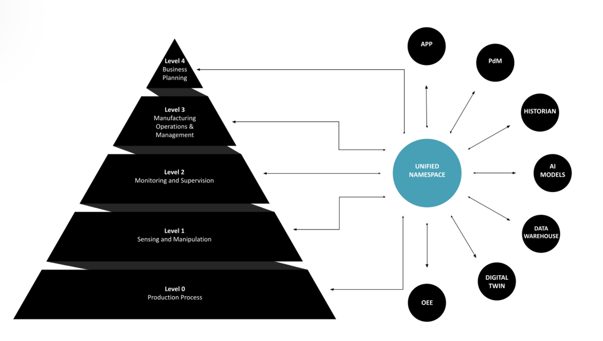

<!--
.. title: index
.. slug: index
.. date: 2024-03-13 12:32:20 UTC+01:00
.. tags: 
.. category: 
.. link: 
.. description: 
.. type: text
.. hidetitle: yes
-->

<h3 style="text-align: center;">Real-Time Insights • Faster Integration • Easy Maintenance</h3>

 
 

## Your Digital Projects Keep Running over Time and over Budget?

* You worry about **missing another deadline** because your team spends too much time getting data.
* Your OT engineers are frustrated with the IT department’s **slow support**.
* You're exhausted from meetings with software vendors who **don't understand** your business.

 

## Imagine Having Your Plant's Data at Your Fingertips…

* Have **confidence** that your data is available at high quality in real time.
* Have **IT and OT** collaborate on the same platform.
* **Trust an engineer** who worked years for aluminium manufacturers like yourself.

 

## Adopt the Unified Namespace (UNS) as the Single Source of Truth

Unify all data in your business and provide a single access point for it. 

  
  
Illustration of a Unified Namespace by the United Manufacturing Hub.

 

## ✅ Benefits

* Real-time insight in your **Overall Equipment Efficiency (OEE)**.
* Lean yet scalable digital infrastructure that's **simple to maintain**.
* No more time-consuming integrations: add new systems in **days instead of months**.

##⚙️ How It Works

<!DOCTYPE html>
<html lang="en">
<head>
<meta charset="UTF-8">
<meta name="viewport" content="width=device-width, initial-scale=1.0">
<title>UNS Implementation Steps</title>
</head>
<body>
<ol>
  <li>
    <strong>Project call</strong>  In this 30-minute video call, we define the implementation scope and deliverables.
  </li>
   
  <li>
    <strong>Technical call</strong>  In this 60-minute call, we define which machines and systems will be integrated into the UNS initially. Together with IT and OT, we establish the technical requirements.
  </li>
   
  <li>
    <strong>On-site UNS workshop</strong>  During a one-day on-site meeting, the UNS is introduced to both OT and IT. The objective is to build trust in-person and set clear expectations.
  </li>
   
  <li>
    <strong>UNS deployment on-premises</strong>  The UNS is configured and deployed at your plant. The majority of this work takes place remotely.
  </li>
   
  <li>
    <strong>Integrating one machine and the MES</strong>  Once the UNS is installed, sensor data from one machine and the Manufacturing Execution System (MES) are integrated into the UNS.
  </li>
   
  <li>
    <strong>Building the first operational dashboard</strong>  The interactive dashboard shows the calculated Overall Equipment Effectiveness (OEE) for the given machine. The objective it to demonstrate tangible UNS results to both OT and management.
  </li>
   
  <li>
    <strong>Commissioning and training</strong>  After ensuring that the UNS deployment meets the specified requirements and functions correctly, the plant personnel is trained in its use and maintenance.
  </li>
</ol>
</body>
</html>

 

<!DOCTYPE html>
<html lang="en">
<head>
<meta charset="UTF-8">
<meta name="viewport" content="width=device-width, initial-scale=1.0">
<title>Calendly Button</title>
<link href="https://assets.calendly.com/assets/external/widget.css" rel="stylesheet">

</head>
<body>

  <a href="#" class="button" onclick="Calendly.initPopupWidget({url: 'https://calendly.com/gontcharovd/introductory-call'});return false;">Book a Free Discovery Call</a>
  
This is a friendly chat about your challenges without commitments to see if we are a good fit.

</body>
</html>

 

# Don't Take My Word For it...

Here's what others in the aluminium industry have said:

<html>
<head>
    
</head>
<body>
    

        

        
Denis worked at Trimet France and has developed R shiny <strong>apps for our production needs</strong>.    We were really impressed by his commitment, the speed and quality of his work.

        
- Olivier Granacher, Senior Process Engineer at TRIMET Aluminium

        

        

        
Denis is a very gifted Data Engineer, having the innate  <strong> understanding of data in the space of manufacturing</strong>.    I had the opportunity to work with Denis for a year at Novelis and during this brief time he had left an impact within the team. 

        
- Cynthia Khan, Data Engineering Services Manager at Novelis

        

        

        
Denis did a great job building the <strong>data infrastructure for our IoT-related features</strong> at ForkOn.  He is highly focused, well  organised and motivated.    He sets very high standards for his work, which always has lead to excellent quality results.

        
- Vlada Pototskaia, Head of Engineering at ForkOn

        

    

</body>
</html>

 

# Still Have Questions?

**Is open-source software reliable?**

The UNS is rooted in IT best-practices. Today, open-source is the standard in every other industry, from pharma to telecommunications. The advantage of mature open-source technologies is the increased availability of experts because of their wide adoption.

**What is the total price?**

My one-time, fixed-price implementation fee and the recurring yearly maintenance price.

**How long will it take?**

The integration work takes three to six months, depending on the speed at which your organization is able to provide the required resources agreed upon in the technical call.

**Will I be the sole developer?**

I will lead the implementation of the project with close support from experienced UNS developers.

**Where can I find support after the engagement?**

After the training, your plant personnel will have the capability to manage the UNS. In addition, I am available for hire as an advisory retainer to oversee the administration of the UNS.

 

# My Availability is Limited

Given the demanding nature of the engagement, I only take on three clients per year. **Secure your spot now**.

 

<!DOCTYPE html>
<html lang="en">
<head>
<meta charset="UTF-8">
<meta name="viewport" content="width=device-width, initial-scale=1.0">
<title>Calendly Button</title>
<link href="https://assets.calendly.com/assets/external/widget.css" rel="stylesheet">

</head>
<body>

  <a href="#" class="button" onclick="Calendly.initPopupWidget({url: 'https://calendly.com/gontcharovd/introductory-call'});return false;">Book a Free Discovery Call</a>
  
This is a friendly chat about your challenges without commitments to see if we are a good fit.

</body>
</html>

 

# Why Work With Me?

Unlike general IT-professionals, I have years of industry experience in aluminium production and recycling.

<!DOCTYPE html>
<html lang="en">
<head>
<meta charset="UTF-8">
<meta name="viewport" content="width=device-width, initial-scale=1.0">
<title>Centered Image</title>

</head>
<body>

</body>
</html>

 

I'm a data consultant who helps aluminium manufacturers break down data silos. 

Over the last five years I have provided data engineering services for the aluminium industry. Currently, I work as an independent data consultant building better data infrastructure for aluminium manufacturers.

Before that I was employed as a data engineer at the aluminium rolling and recycling company Novelis. There, I was responsible for transferring process data from rolling mills and cast house furnaces to the cloud.

I began my career as a process engineer at the aluminium smelter of TRIMET at Saint-Jean-de-Maurienne in France. Later I was working as a process engineer at their smelter in Essen, Germany where I developed control software for the electrolysis process.

I hold a degree in Materials Engineering from KU Leuven in Belgium and am based in Berlin, Germany.

# Contact

📫 [Get my weekly newsletter](https://subscribe.gontcharov.eu/newsletter){:target="_blank"}  
📧 [denis@gontcharov.eu](mailto:denis@gontcharov.eu){:target="_blank"}  
🌐 [https://gontcharov.eu](https://gontcharov.eu){:target="_blank"}  
👤 [https://www.linkedin.com/in/gontcharovd](https://www.linkedin.com/in/gontcharovd){:target="_blank"}

***
